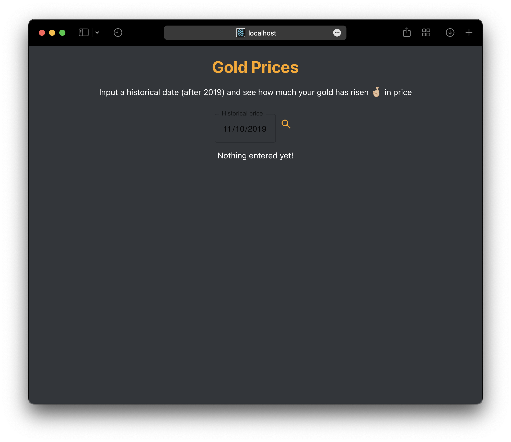
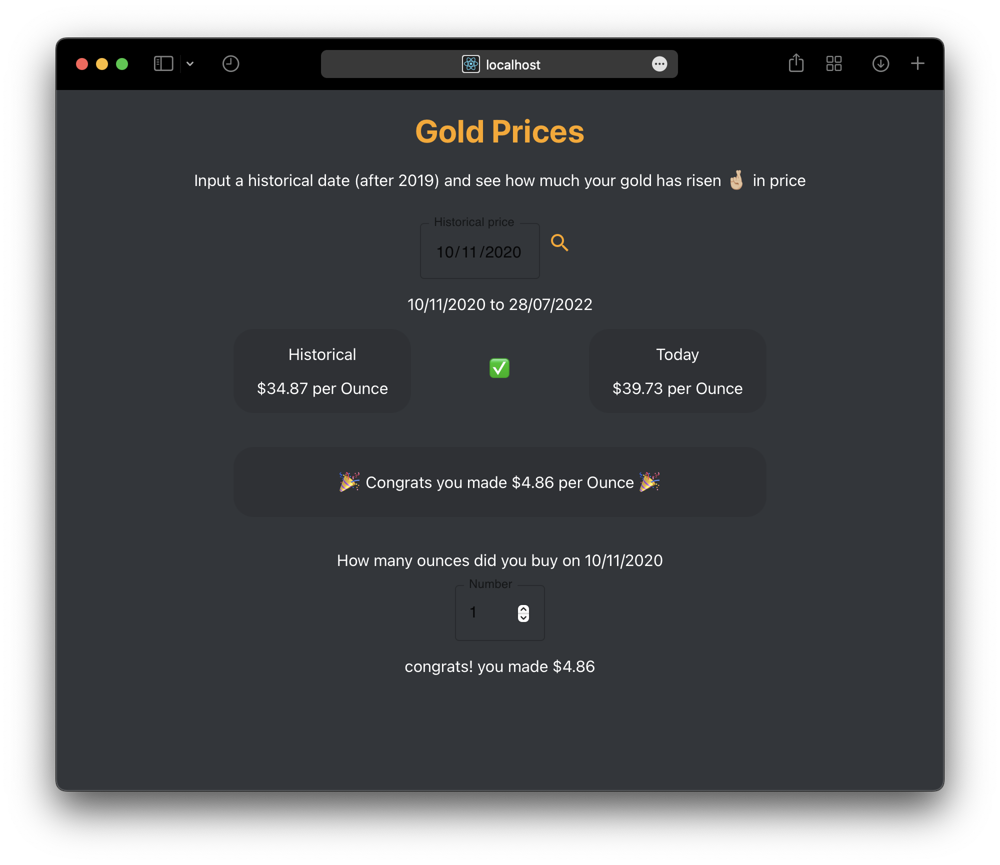
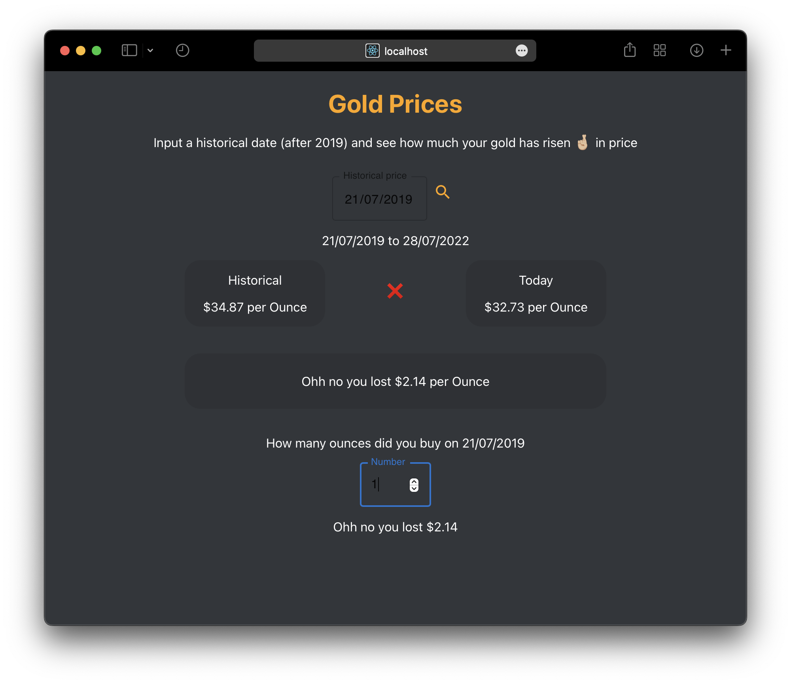

# MSA FrontEnd Project ! 

A front end website that compares an entered dates gold price (from 2019 onwawrds)...
Then the react app compares the prices and offers you the ability to enter how many ounces you baught on that date to show how much money you have made! 


This repo was created very late in the project as running ```npm audit fix --force``` will actually break everyting, you can find the now decrepid repo at [Jaorow/phase2Frontend](https://github.com/Jaorow/phase2Frontend)

## PROJECT DETAILS
### Start screen before any input is receved.

### Page if gold price has risen since historical date.

### Page if gold price has dropped since historical date.



# phase three

Welcome to Phase 3! Congratulations for making it so far. For Phase 3, the requirement is to implement some more advanced features that are a bit more involved or difficult to get working.

## Front End Requirements

To pass phase 3 for the front-end, you will need to have any __five__ of the following advanced features, or any __two__ of the extra for experts features.

## Advanced Features List

- [x] UI Scalability with window size
- [x]  Mobile first development (using media query breakpoints, etc)
* Storybook w/ both actions and interactions (play)
* Progressive Web App (PWA) functionality w/ clear use of the service worker
* API connection to your own API that is cloud hosted
* Comprehensive unit testing
* OAuth2 with PKCE login w/ at least ONE third party provider
* Clear usage of Websockets
- [x] At least one fluid animation
* Redux state management
* Demonstration of complex FE logic

## Expert Features

* A YAML CI/CD pipeline which builds and deploys a containerised application to either Azure or AWS, which is configured to use environment variables correctly.
* Usage of SSR / SSG with at least __three__ of the advanced features
* Usage of Terraform to structure and provision a cloud environment, which is incorporated into a CI/CD pipeline

## Example Repository

The following front-end code is meant to be a reference, as to how you could implement some of these advanced features. This assignment is going to be tough, and we're sure you're going to have a lot of questions. Please ask them over on the discord server, where we will respond ASAP!