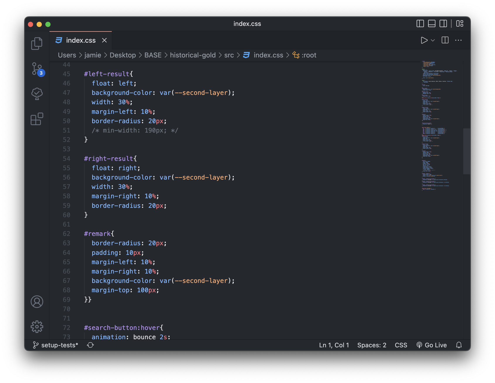
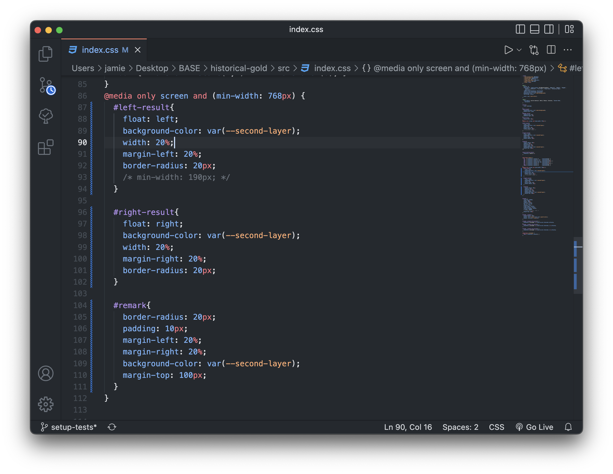
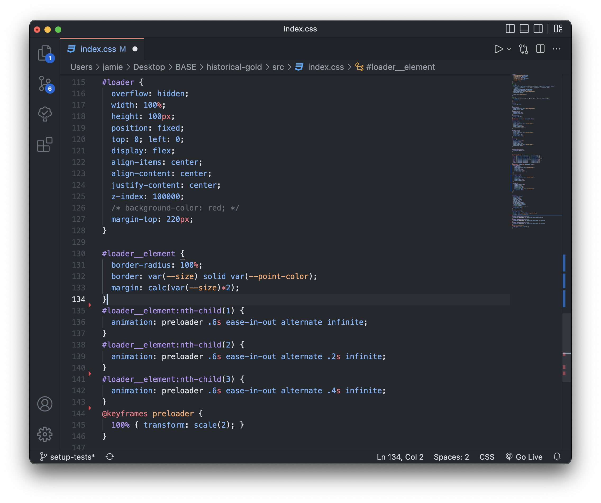
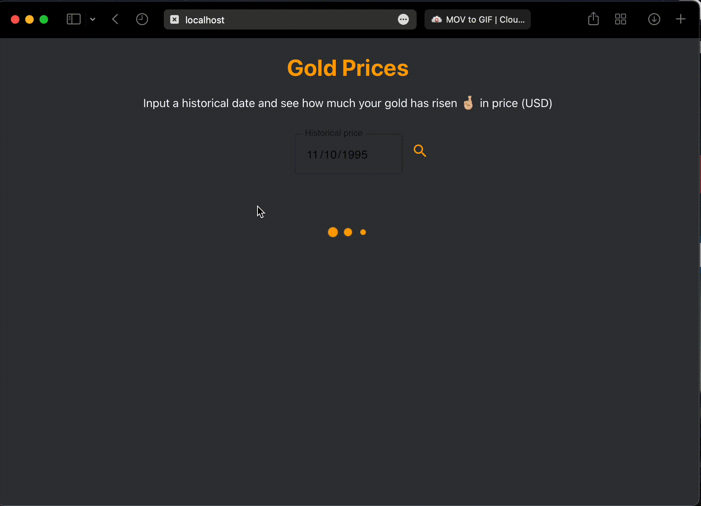
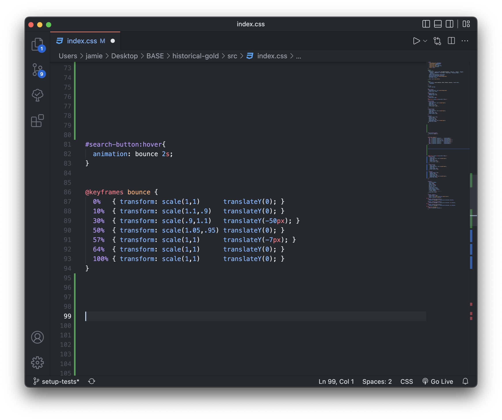
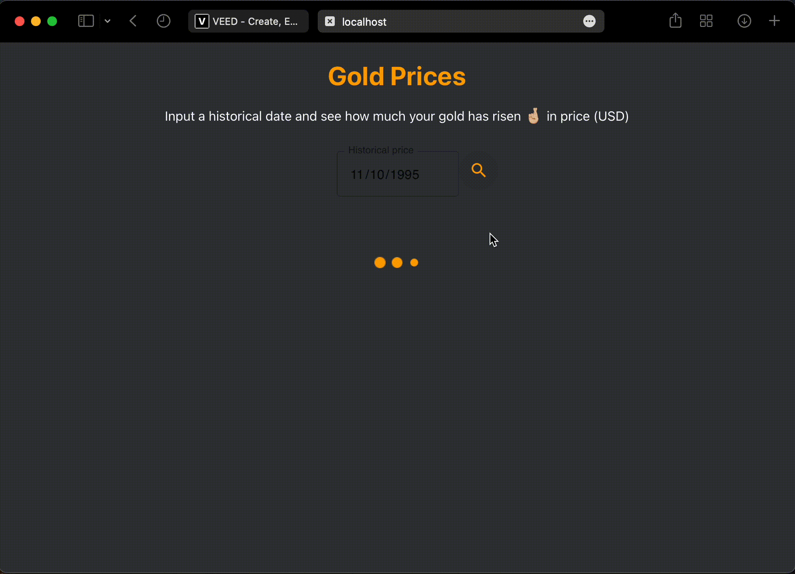
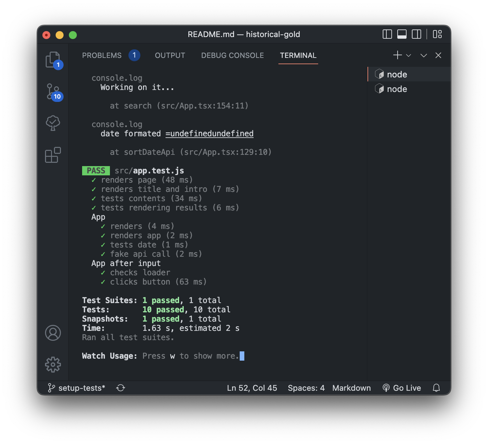
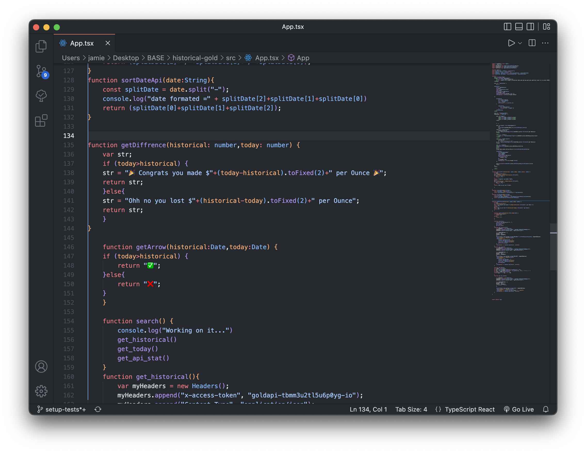

# MSA FrontEnd Project ! 

A front end website that compares an entered dates gold price (from 2019 onwawrds)...
Then the react app compares the prices and offers you the ability to enter how many ounces you baught on that date to show how much money you have made! 


This repo was created very late in the project as running ```npm audit fix --force``` will actually break everyting, you can find the now decrepid repo at [Jaorow/phase2Frontend](https://github.com/Jaorow/phase2Frontend)

## PROJECT DETAILS
### Start screen before any input is receved.

### Page if gold price has risen since historical date.

### Page if gold price has dropped since historical date.


# Phase Three

For Phase three I implemented five advanced fetures into my website


### UI
- [x] UI Scalability with window size
- [x]  Mobile first development (using media query breakpoints, etc)

These first two requirements were rather easy to implement as i have worked with html and css before so knew my way around UI Scalability and Mobile First Dev using Meda Querys. 

### UI Scalability

### Media Querys
* The UI looked good on any ranges above 768px as is however when dropping below 768px ( large tablet size ) I changed the scaling percentage to fit the screen better, testing was made very easy with chromes build in screensize selector


### Animations
- [x] At least one fluid animation

I enjoyed making fluid animations with css Keyframes and animation methods so i made two animations inside my app

The first being a loading animation showen before the result is rendered




And the second is the search button bouncing on hover




### Testing
- [x] Comprehensive unit testing
see ```src/app.test.js``` for unit testing.

this task was much harder than the others as it was quite hard to find a tutorial showing how to test after an api call, testing the app before an api call was made was okay however simulating an api call and seeing the results proved more tricky 

### Front End logic
- [x] Demonstration of complex FE logic

asuming Front end logic is coding logic in your front end app i compleated this  by having a function that calculates the amount you have made of a set amount of gold.

